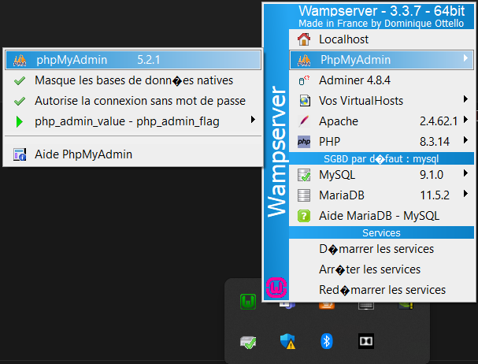
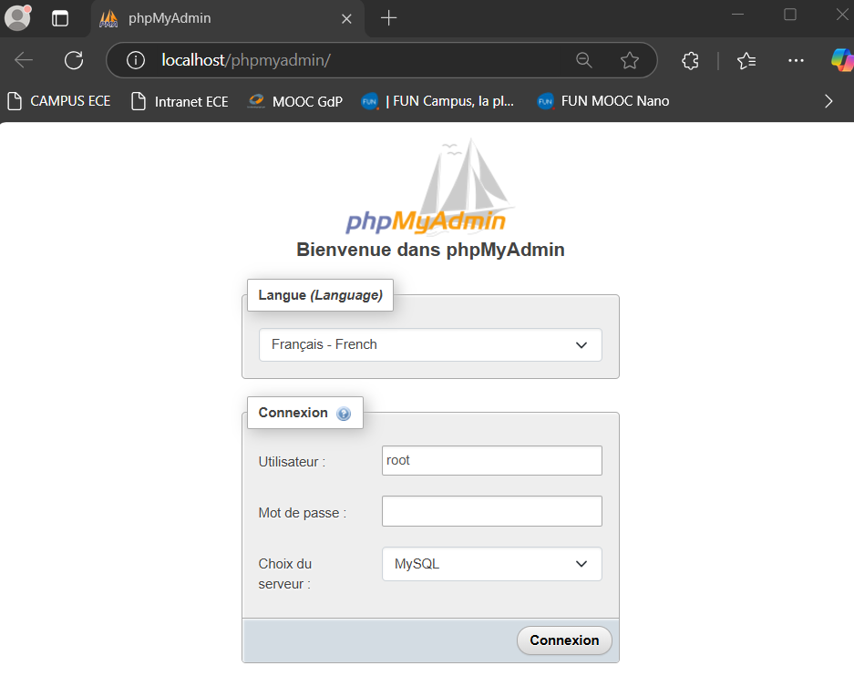
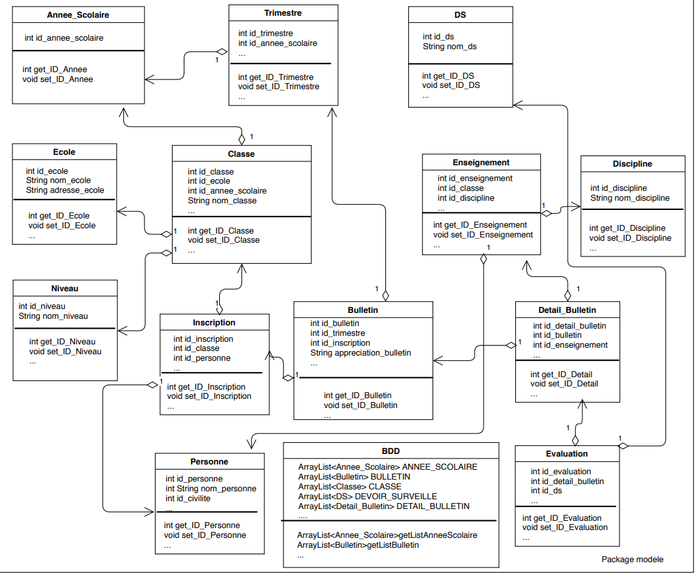
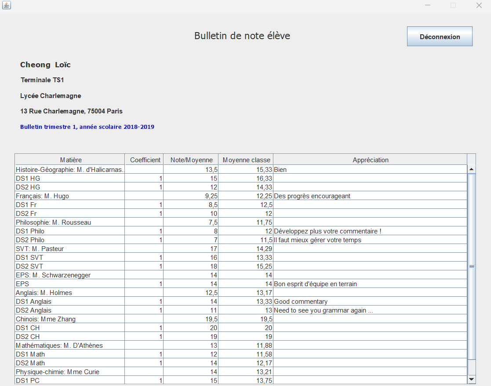
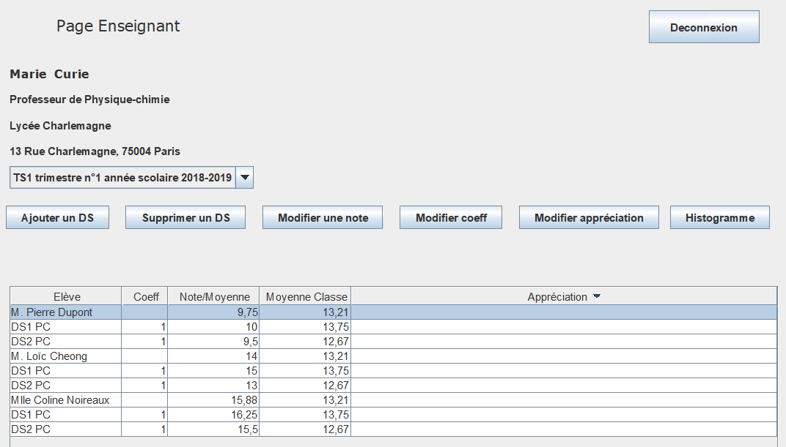

# About the project
Graphical Interface for School Data Management

This is a simple project written in Java that provides a graphical user interface (GUI) for managing school-related data.
Users can view, add, edit, or delete records directly through the interface.

# Prerequisites:
If you want to use the software, follow the steps below: 
1. Download WampServer from https://www.wampserver.com/
2. Install it
3. Open Wampserver and start using phpMyAdmin

  

A web browser will open, enter the credentials.

  

* User : root
* password : (empty field. By default, there is no password)

4. Create a new database named 'gestion_ecole'
5. Import the data from `gestion_ecole.sql`

# Data Description:
In this section, we provide an overview of the existing database, which will be utilized by the school management system.
The database is based on a relational model that represents various aspects of school data.

  

# GUI
To launch the software, run the executable jar file in `Gestion_Ecole/Gestion_Ecole/dist/Gestion_Ecole.jar`

At first, you will see a login page. To sign in, you will need of course your credentials. Simple user cannot create an account in a school management system. Only the admin has this power.

  

There are 3 types of users :
- students : they can only read their school transcript 
    * id : loic.cheong
    * password : 1234
- teachers : they can read, add, modify and delete grades
    * id : marie.curie
    * password : 1234
- admins :  they manage the database, so they can read, add, modify and delete users
    * id : manolo.hina
    * password : 1234

Here is what looks like the admin page

  

Student page

  

Teacher page

  

